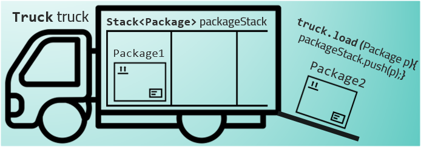

<!-- PROJECT SHIELDS -->

[![Contributors][contributors-shield]][contributors-url] [![Forks][forks-shield]][forks-url] [![Stargazers][stars-shield]][stars-url] [![Issues][issues-shield]][issues-url] [![License][license-shield]][license-url]

<!-- PROJECT LOGO -->
 

    
<h3 align="center">Bin Packing Problem</h3>

  

     A CLI-based program to solve the Bin Packing Problem with Next Fit & Best Fit Decreasing algorithm 
     
    <a href="https://github.com/greydelta/bin-packing-problem"><strong>Explore the docs »</strong></a>
     
     
    <a href="https://github.com/greydelta/bin-packing-problem">View Demo</a>
    ·
    <a href="https://github.com/greydelta/bin-packing-problem/issues">Report Bug</a>
    ·
    <a href="https://github.com/greydelta/bin-packing-problem/issues">Request Feature</a>
  

<!-- ABOUT THE PROJECT -->

## About The Project

This program aims to demonstrate the use of algorithms to solve the bin packing problem and choose the optimal solution.

The bin packing problem is defined by 2 properties, which are the item sizes and the bin container. In this case, a delivery processing facility is used to simulate a scenario.

- bin capacity = Truck load
- item size = Package weight

In each delivery batch, the algorithm would determine which **PACKAGE** should be loaded into which **TRUCK**.

The program will require the user to input:

- Truck capacity / load
- The weight of the packages

Or conversely, use data from the existing data files:

- Make changes accordingly in `Main.java`, under Method B2 - `getDataFromFile()`

The program will then generate the solutions based on the 2 algorithms:

- Next Fit Algorithm (_Feasible solution_)
- Best Fit Decreasing Algorithm (_Optimal solution_)

### Assumptions:

1. Weight ----> Measured only in KG (only in Integer)
2. Num of Packages ----> Any number of packages is acceptable
3. Size --->

- Assume that company has estimated that the load limit for each truck has taken into account the size of parcel (regardless of how big or small)
- Hence, physical size is disregarded in the calculation of the two following approximation algorithms

### Implementation Overview:

[![screenshot][media-screenshot]](#)

### Flowcharts

(Left: BFD Algorithm - Right: NF Algorithm):

 

[![flowchart][media-flowchart]](#)

(<a href="#top">back to top</a>)

### Sample Output:

[![screenshot1][media-screenshot1]](#)

(<a href="#top">back to top</a>)

### Built With

(<a href="#top">back to top</a>)

<!-- GETTING STARTED -->

## Getting Started

## Using  :

#### Prerequisites

- Install [Extension Pack for Java](https://marketplace.visualstudio.com/items?itemName=vscjava.vscode-java-pack)

#### Installation

- Import Project Folder in VS Code

#### Usage

1. Right click on `App.java`

1. Click "Run Java"

(<a href="#top">back to top</a>)

## Using  :

#### Prerequisites

- Download & install [JRE-15](https://www.oracle.com/java/technologies/javase/jdk15-archive-downloads.html) and above according to your OS

#### Installation

1. Import Project Folder in Eclipse IDE

1. Right click on Project Folder in Project Folder View

1. Click "Build Path"

1. Click "Configure Build Path"

1. Under the "Libraries" Tab, click JRE System Library

1. Click "Edit"

1. Under "Execution Environment", choose "JavaSE-15 (jre)" from the dropdown

1. Click "Finish" then "Apply and Close"

### Usage

1. Right click on Project Folder in Project Folder View

1. Click "Run As"

1. Click "Java Application"

(<a href="#top">back to top</a>)

<!-- CONTRIBUTING -->

## Contributing

Contributions are what make the open source community such an amazing place to learn, inspire, and create. Any contributions you make are **greatly appreciated**.

If you have a suggestion that would make this better, please fork the repo and create a pull request. You can also simply open an issue with the tag "enhancement". Don't forget to give the project a star! Thanks again!

1. Fork the Project
2. Create your Feature Branch (`git checkout -b feature/AmazingFeature`)
3. Commit your Changes (`git commit -m 'Add some AmazingFeature'`)
4. Push to the Branch (`git push origin feature/AmazingFeature`)
5. Open a Pull Request

(<a href="#top">back to top</a>)

<!-- LICENSE -->

## License

Distributed under the MIT License. See `LICENSE.txt` for more information.

(<a href="#top">back to top</a>)

<!-- CONTACT -->

## Contact

    

 

Project Link: [https://github.com/greydelta/bin-packing-problem](https://github.com/greydelta/bin-packing-problem)

(<a href="#top">back to top</a>)

<!-- ACKNOWLEDGMENTS -->

## Acknowledgments

(<a href="#top">back to top</a>)

<!-- MARKDOWN LINKS & IMAGES -->

[contributors-shield]: https://img.shields.io/github/contributors/greydelta/bin-packing-problem.svg?style=for-the-badge
[contributors-url]: https://github.com/greydelta/bin-packing-problem/graphs/contributors
[forks-shield]: https://img.shields.io/github/forks/greydelta/bin-packing-problem.svg?style=for-the-badge
[forks-url]: https://github.com/greydelta/bin-packing-problem/network/members
[stars-shield]: https://img.shields.io/github/stars/greydelta/bin-packing-problem.svg?style=for-the-badge
[stars-url]: https://github.com/greydelta/bin-packing-problem/stargazers
[issues-shield]: https://img.shields.io/github/issues/greydelta/bin-packing-problem.svg?style=for-the-badge
[issues-url]: https://github.com/greydelta/bin-packing-problem/issues
[license-shield]: https://img.shields.io/github/license/greydelta/bin-packing-problem.svg?style=for-the-badge
[license-url]: https://github.com/greydelta/bin-packing-problem/blob/master/LICENSE.txt
[media-screenshot]: images/visual.png
[media-screenshot1]: images/output.png
[media-flowchart]: images/flowchart.png
